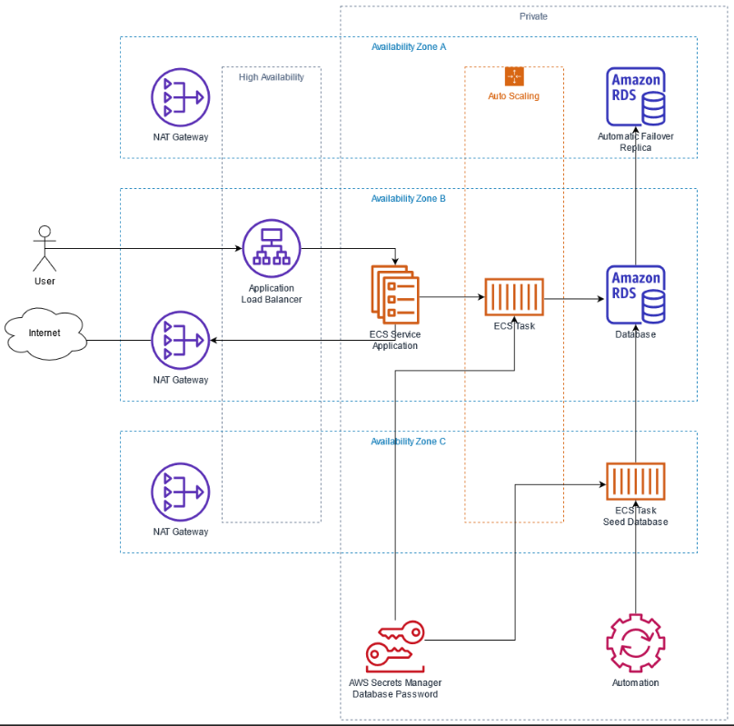
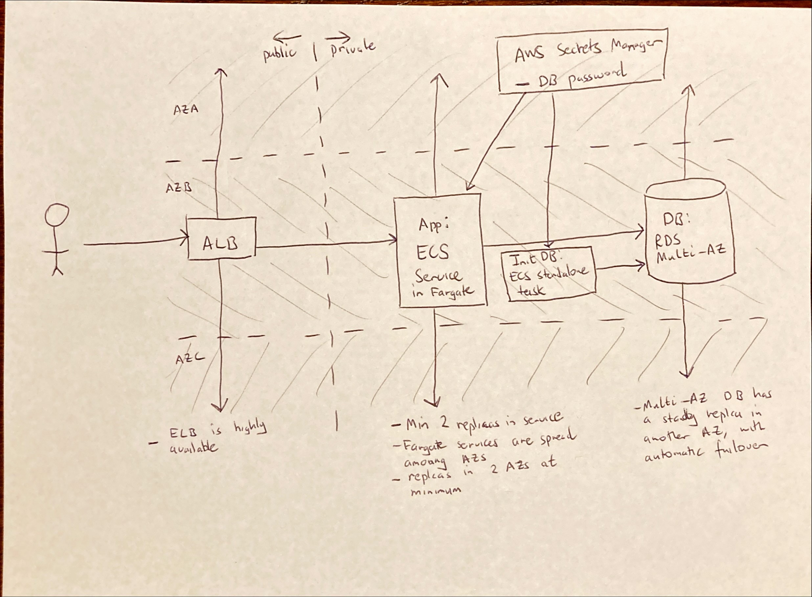

# Servian Technical Challenge

## Prerequisites

- Docker
- Bash
- AWS Account

## TODO

- [x] Shellcheck scipt
- [x] Terraform scripts
- [x] VPC
- [x] RDS
- [x] AWS Secrets Manager secret for DB password
- [x] ECS seed standalone task
- [x] ECS app service
- [x] Autoscaling
- [x] Cleanup
- [x] Documentation

## Issues and next steps

- Domain name and certificate
- CI/CD
- Smoke test
- Loadtest script
- Splitting Terraform into modules
- Script to taint null-resource which runs the seed job

## Usage

TODO

## System design

- Application is deployed with RDS and ECS (Fargate)
- Database is seeded with a standalone ECS task
- Automation uses Terraform and AWS CLI
- See [the ADRs](doc/adr) for more details

### System diagram

[System diagram drawio source](doc/assets/system-diagram.drawio)

### Draft system diagram

